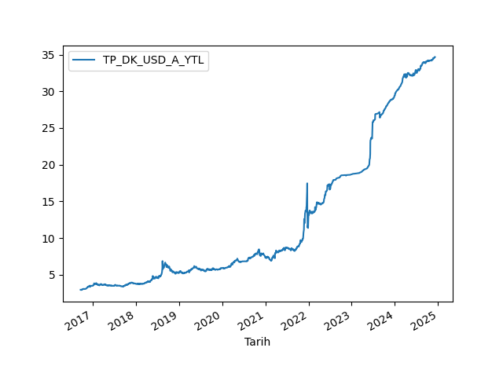
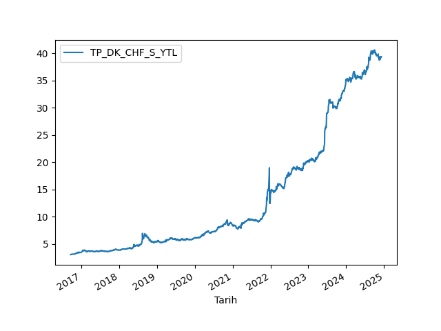

# Currencies with TCMB
This service provides the latest currency rates from the Central Bank of the Republic of Turkey (TCMB).

## Description
This service provides the latest currency rates from the Central Bank of the Republic of Turkey (TCMB).

## Images
<!-- ["TP.DK.USD.S.YTL", "TP.DK.USD.A.YTL", "TP.DK.EUR.S.YTL", "TP.DK.EUR.A.YTL", "TP.DK.GBP.S.YTL", "TP.DK.GBP.A.YTL", "TP.DK.CHF.S.YTL", "TP.DK.CHF.A.YTL", "TP.DK.JPY.S.YTL", "TP.DK.JPY.A.YTL"] -->







## Create a virtual environment
```bash
python3 -m venv venv
```

## Activate the virtual environment
```bash
source venv/bin/activate
```

## Install dependencies
```bash
pip install -r requirements.txt
```

## Run the service
```bash
python __main__.py
```

## Deactivate the virtual environment
```bash
deactivate
```